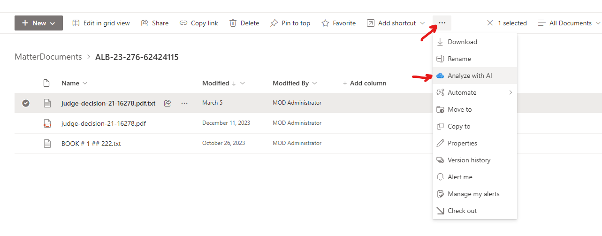
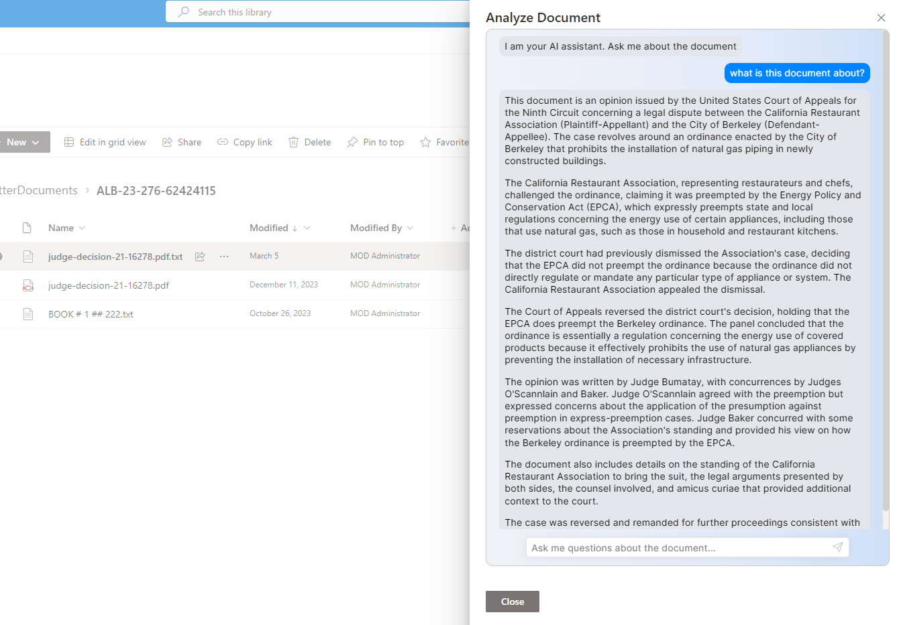

# spfx-azure-ai-chat

## Summary

This project implements a chatbot for SharePoint Online. It works as a Copilot of sorts for interacting with a document. Install the command extension and select a document in a document library. The selected document will be transformed in text file if it is not already in text format using Azure Document AI and this text command will be included in the bot instructions.
This project leverages the amazing chatbot react component [deep-chat](https://github.com/OvidijusParsiunas/deep-chat) by [OvidijusParsiunas](https://github.com/OvidijusParsiunas)


## Used SharePoint Framework Version


## Applies to

- [SharePoint Framework](https://aka.ms/spfx)
- [Microsoft 365 tenant](https://docs.microsoft.com/en-us/sharepoint/dev/spfx/set-up-your-developer-tenant)

> Get your own free development tenant by subscribing to [Microsoft 365 developer program](http://aka.ms/o365devprogram)

## Prerequisites

> Azure OpenAI subscription (at some point it will also work with OpenAI's ChatGPT)

> Subscription to Azure Document Layout to extract the content of PDF and Word documents

## Solution

| Solution    | Author(s)                                               |
| ----------- | ------------------------------------------------------- |
| spfx-azure-ai-chat | Rodney Viana |

## Version history

| Version | Date             | Comments        |
| ------- | ---------------- | --------------- |
| 1.1     | March 10, 2021   | Update comment  |
| 1.0     | January 29, 2021 | Initial release |

## Disclaimer

**THIS CODE IS PROVIDED _AS IS_ WITHOUT WARRANTY OF ANY KIND, EITHER EXPRESS OR IMPLIED, INCLUDING ANY IMPLIED WARRANTIES OF FITNESS FOR A PARTICULAR PURPOSE, MERCHANTABILITY, OR NON-INFRINGEMENT.**

---

## How to install it


> Download the last released package

> Deploy to your tenant or site collection App Catalog

> Configure the chat bot (for now use PowerShell, UI configuration will be added in the future)

> Use Set-ChatInfo.ps1 to set Document AI and Azure OpenAI keys and endpoints

**Example:**
```powershell
.\Set-ChatInfo.ps1 -Site https://contoso.sharepoint.com/sites/Texas -FormsEndpoint https://contoso-doc-intel.cognitiveservices.azure.com/ -FormsKey "123456a90cdd4359b872ca794a0c1170" -AzureOpenAIEndpoint https://contoso-deployment.openai.azure.com/openai/deployments/gpt4-turbo/chat/completions?api-version=2023-07-01-preview -AzureOpenAIKey "1234563e59c4f1e8b5d958db6838bc0" -SystemInstructions "You are a legal scholar and you will respond questions about this legal document: `n@text" -WelcomeMessage "I am your AI assistant. Ask me about the document"

# Where:
#   -Site is the site collection URL
#   -FormsEndpoint is the Azure Document AI Layout's endpoint
#   -FormsKey is the secret key for Azure Document AI Layout
#   -AzureOpenAIEndpoint is the Azure OpenAI AI's chat completion endpoint
#   -AzureOpenAIKey is the secret key for Azure Open AI chat completion deployment
#   -SystemInstruction contains the rule for the chat. For example you can limit the scope of responses and the type of expert the AI is
#   -WelcomeMessage the message that will be shown when the bot loads
```

> On any document library select **just one document** (pdf, word or text) and select the elipsis (...) if ```Analyze with AI``` is not visible





## Features

- Custom Azure Open AI chat bot that interacts with the document
- The document in text format cannot be larger than the context limit of the model (ChatGPT 4 Turbo can handle 128K token)


## References

- [Getting started with SharePoint Framework](https://docs.microsoft.com/en-us/sharepoint/dev/spfx/set-up-your-developer-tenant)
- [Publish SharePoint Framework applications to the Marketplace](https://docs.microsoft.com/en-us/sharepoint/dev/spfx/publish-to-marketplace-overview)
- [Microsoft 365 Patterns and Practices](https://aka.ms/m365pnp) - Guidance, tooling, samples and open-source controls for your Microsoft 365 development
